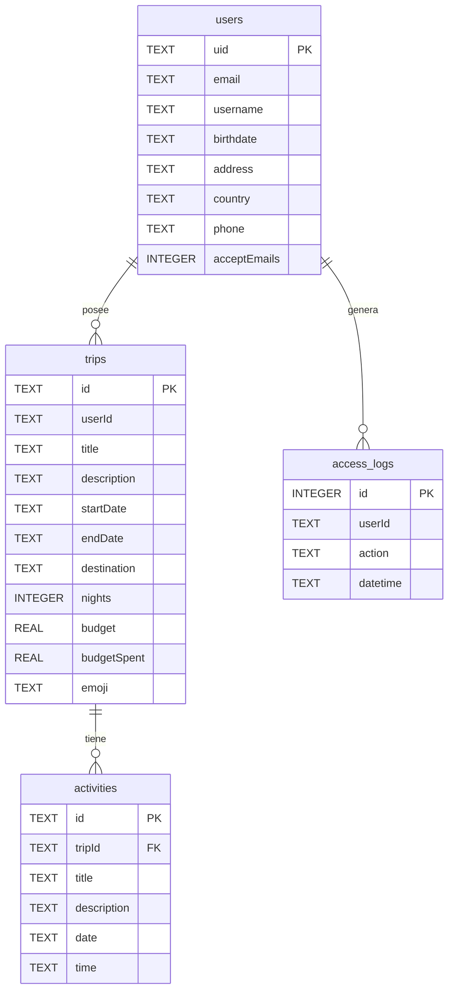
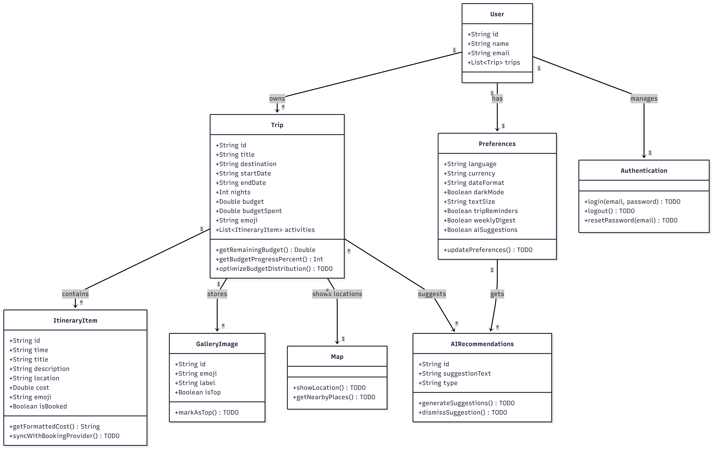

# Diseño Arquitectónico de Irida

## Arquitectura General
Irida sigue una arquitectura **MVVM (Model-View-ViewModel)** con **Repository Pattern** para separar responsabilidades y facilitar el testing.

UI (Compose Screens)
↓
ViewModels (Hilt @HiltViewModel)
↓
Repositories (interfaces en domain/)
↓
┌────┴────┐
Room (local) Firebase Auth (remoto)

---

## Esquema de Base de Datos (Room SQLite)


---

## Flujo de Autenticación

App abre
↓
SplashScreen
↓ authViewModel.isLoggedIn?
Sí → HomeScreen
No → LoginScreen
↓
┌─────┴──────┐
Registrarse  Olvidé contraseña
↓               ↓
RegisterScreen  ForgotPasswordScreen
↓               ↓
Firebase         Firebase
createUser    sendPasswordReset
↓
LoginScreen ← (éxito)
↓
HomeScreen
↓ (Logout desde PreferencesScreen)
LoginScreen (back stack limpio)


---

## TypeConverters

`LocalDate` y `LocalTime` se almacenan como `String` en formato ISO-8601. Se eligió este enfoque porque:
- minSdk 26 garantiza soporte nativo de `java.time`
- Los strings son legibles directamente en el explorador de base de datos
- Room no soporta `LocalDate`/`LocalTime` de forma nativa

---

## Filtrado de viajes por usuario (T4.2)

Cada viaje almacena el `userId` del propietario. El DAO filtra en SQL:

```sql
SELECT * FROM trips WHERE userId = :userId ORDER BY startDate ASC
```

TripListViewModel obtiene el userId de FirebaseAuth.currentUser?.uid, garantizando que cada usuario solo ve sus propios viajes.

## Log de Accesos (T4.3)
`AuthViewModel` registra un `AccessLogEntity` en Room en cada LOGIN y LOGOUT:

```
AuthViewModel.login()  → AccessLogEntity(userId, action="LOGIN",  datetime=now)
AuthViewModel.logout() → AccessLogEntity(userId, action="LOGOUT", datetime=now)
```

## Modelo de Dominio


## Estructura de carpetas (mapeo con rúbrica Sprint 04)

| Convención rúbrica | Ubicación en el proyecto                                                |
|--------------------|-------------------------------------------------------------------------|
| `view`             | `app/.../ui/screens/` (Compose UI screens)                              |
| `viewmodel`        | `app/.../ui/viewmodels/` (`@HiltViewModel`)                             |
| `repo`             | `app/.../data/repository/` (`*RepositoryImpl`) y `domain/` (interfaces) |
| `di`               | `app/.../di/` (Hilt modules: Database, Network, Repository, Firebase)   |
| `data`             | `app/.../data/` (local + remote + repository)                           |

La anidación bajo `ui/` y `data/` sigue la convención estándar de Android (Jetpack Compose + MVVM) y permite separar la capa de presentación (`ui`) de la capa de datos (`data`).
